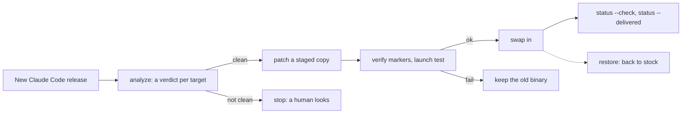

# claude-code-dispositions

<!-- DRAFT: needs author -->
**Claude Code's system prompt, re-aimed at the person who actually runs it.**


[](https://github.com/Piebald-AI/tweakcc)

<!-- DRAFT: needs author -->
## TL;DR

- 🎯 **The problem.** Claude Code's prompt is written for a user it has never
  met. If you run it all day, that calibration is wrong for you, always in the
  same direction: too much asking, too much narrating, too much restating.
- ✍️ **The change.** The calibration for that unknown user comes out. A stated
  disposition goes in: whom Claude is working for, and what each side owns.
- 🧾 **Every edit is argued.** The spec was written before any prompt was
  touched. An edit without a line in it gets reverted.
- 🛠️ **It stays installed.** One Python file patches a staged copy of the
  binary, verifies it, swaps it in, and rolls back byte for byte.
- 🚫 **What it is not.** Not a jailbreak and not a personality mod. Disagreeing
  when warranted, reporting failures faithfully and not fabricating all stay.

<!-- DRAFT: needs author -->
The installed replacement for Claude Code's "Delivering work" section opens
like this
([`edits/system-prompt-delivering-work-at-full-scope.md`](edits/system-prompt-delivering-work-at-full-scope.md)):

> There is an operator on the other end of this, not an audience. They ran it,
> they own the consequences of their own instructions, and they will say when
> they want more caution.

<!-- DRAFT: needs author -->
> [!NOTE]
> This is a personal project and has no connection to Anthropic. It patches the
> Claude Code binary on your own machine, built on
> [tweakcc](https://github.com/Piebald-AI/tweakcc). A Claude Code update
> replaces the patched binary, which is what most of the tooling here is for.

<!-- DRAFT: needs author -->
## Contents

- [What changes](#what-changes)
- [Quick start](#quick-start)
- [How an update goes](#how-an-update-goes)
- [What is here](#what-is-here)
- [Why](#why)
- **The details**
  - [Using it](#using-it)
  - [What assumes my setup](#what-assumes-my-setup)
  - [Reading order](#reading-order)
  - [Licence](#licence)

<!-- DRAFT: needs author -->
## What changes

The left column paraphrases the stock behaviour; this tree carries none of
Anthropic's text ([`ABOUT-THIS-REPOSITORY.md`](ABOUT-THIS-REPOSITORY.md)).
[`edits/targets.json`](edits/targets.json) has every target with its intent.

| | Stock Claude Code | With these edits | Target |
| --- | --- | --- | --- |
| 👤 **Reader** | An unknown user who may need reassurance | An operator who ran the command and owns the consequences | `system-prompt-delivering-work-at-full-scope` |
| 🚦 **Permission** | Confirm before acting | Reversible work inside the task is already authorized. Ask only for a commitment outside it | same |
| 📬 **Closing message** | An account of what was done | Where things stand first. What changed, what happens if nothing is done. How it was done stays out | `disposition-floor-under-every-output-style` |
| 🔇 **Progress updates** | A reminder to say something after a run of silent tool calls | Switched off | `silent-turn-reminder-off` |
| 🌿 **Commits** | Commit and push wait until the user asks | Committing finished work is part of the task. Someone else's repository still needs a go-ahead | `git-commit-authority` |
| 🤝 **Delegation** | Late sections steer away from subagents | The parent may delegate. A subagent spawns further ones only on explicit opt-in | `delegation-override-cut`, `subagent-delegation-opt-in` |
| 🩹 **Corrections** | Restraint, stated as a stack of don'ts | The same restraint stated once. A follow-up question is not a sign of an error | `system-prompt-correction-restraint` |
| 📋 **TodoWrite** | Mechanics plus a mass of worked examples | The mechanics | `tool-description-todowrite` |

<!-- DRAFT: needs author -->
## Quick start

**Just read it.** Start with
[`spec/00-disposition-spec.md`](spec/00-disposition-spec.md), then open any file
in [`edits/`](edits/).

**Try the fragments with tweakcc alone.** This installs the replacement
fragments and nothing else (see [Using it](#using-it) for what is missing):

```sh
cp edits/system-prompt-*.md edits/tool-description-*.md ~/.tweakcc/system-prompts/
tweakcc --apply
```

**Install everything with `ccctl.py`.** It needs git, node with tweakcc 4.3.3
or newer, and Claude Code's native install:

```sh
mkdir ~/ccctl && cd ~/ccctl            # config, snapshots and changelog live here
cp <your clone>/tools/ccctl.py .
python3 ccctl.py init <git-url>        # sparse-clones the repository into ./repo
python3 ccctl.py apply                 # pull, patch a staged copy, verify, swap
python3 ccctl.py status --check        # 0 patched and verified, 2 fault, 3 stock on purpose
python3 ccctl.py restore               # byte-exact rollback to stock
```

<!-- DRAFT: needs author -->
## How an update goes

The live binary is never edited in place. A new Claude Code release is analysed
first, and nothing is swapped in unless every target has a clean verdict and
every marker verifies.



## What is here

<!-- DRAFT: needs author -->
| Path | What it is |
| --- | --- |
| [`spec/`](spec/) | The disposition spec, written before any stock prompt was touched, so each edit is a diff against an intent rather than a reaction to a block of text. `00` is the argument, `10` the text that is installed, `15` what the closing message owes the operator, `30` and `40` how the edits survive updates. |
| [`edits/`](edits/) | The change itself, in tweakcc's per-component format: one whole replacement body per changed prompt fragment, `targets.json` (every target with its intent and the spec line behind it), `MARKERS.txt` and `ANTIMARKERS.txt` (what a patched binary must and must not contain), `reviews.json`. |
| [`tools/ccctl.py`](tools/ccctl.py) | One file, standard library only, for Linux, macOS and Windows: fetch a release, analyse it against the edits, patch a staged copy, verify, swap, roll back. [`tools/README.md`](tools/README.md) lists the helpers around it. |
| [`tools/tweakcc-overlays/`](tools/tweakcc-overlays/) | Patches against tweakcc's own source for Claude Code builds its feature patches did not yet cover. |
| [`probes/`](probes/) | Nine small synthetic repositories built for a probe battery that has since been retired. |
| [`release.json`](release.json) | The Claude Code release the edits were last checked against, and the stock binary hashes for it. |
| [`AGENTS.md`](AGENTS.md) | The working agreement for an agent operating on this repository. |

<!-- DRAFT: needs author -->
What this tree leaves out, how much stock wording the edits still carry, and
what the licence covers: [`ABOUT-THIS-REPOSITORY.md`](ABOUT-THIS-REPOSITORY.md).

## Why

Claude Code ships a large, layered set of prompts: a main loop prompt, per-tool
descriptions, per-subagent prompts, and per-turn injected reminders. Much of it
is audience calibration written for an unknown user — verbosity floors,
restate-before-answering, confirm-before-acting, stacked negative instructions.
For an operator who runs several sessions a day, that calibration is wrong in a
specific and consistent direction.

The goal is **not** to strip character or to remove epistemic hygiene
(disagreeing when warranted, reporting failures faithfully, not fabricating).
Those are load-bearing. The goal is to replace generic-user calibration with a
stated disposition for both parties — Claude's role and mine — on the working
theory that dispositions regenerate correct micro-decisions across a long
trajectory where enumerated rules degrade.

---

<!-- DRAFT: needs author -->
# The details

## Using it

<!-- DRAFT: needs author -->
**Read.** Start with [`spec/00-disposition-spec.md`](spec/00-disposition-spec.md).
Every edit has to be justified by a line in it, and an edit that is not gets
reverted.

**Compare.** Each `edits/<id>.md` is named after tweakcc's id for the component
it replaces. To see the stock text next to it, let tweakcc fetch the prompt data
for the release the edits were last checked against, the `ccVersion` in
`release.json`:

```sh
tweakcc --list-system-prompts <version>
```

That lists every component by id and caches the full text in
`~/.tweakcc/prompt-data-cache/prompts-<version>.json`. Once `ccctl.py` is set
up, `python3 ccctl.py diff custom <version> <id>` prints stock against the
replacement as a unified diff.

**Apply with tweakcc alone.** tweakcc reads user modifications from
`~/.tweakcc/system-prompts/`, so the two commands under
[Quick start](#quick-start) install the replacement fragments and nothing else.
The rest of the change is text tweakcc does not extract, such as the reporting
floor under every output style and the Bash tool's compact git section
(`spec/00` §2.3), and gates rather than text, such as the model clauses of the
silent-turn reminder. Those are adhoc patches, and only `ccctl.py` applies
them. On Windows, `tweakcc --apply` did not write fragments when this was built
(`spec/40`); use `ccctl.py` there.

**Apply with `ccctl.py`.** It patches a staged copy and swaps it in only after
every marker verifies; the live binary is never edited in place. `apply` pulls
from the `init` URL before every run, so point it at a fork you can edit. A
Claude Code update replaces the patched binary; for a new release,
`ccctl.py analyze <version>` gives every target a verdict before anything
changes, and `ccctl.py update <version>` patches and swaps only on a clean
verdict. The exit codes, the settings that stop Claude Code from updating
itself, and the session-start tripwire are in the runbook in
[`spec/40-update-pipeline.md`](spec/40-update-pipeline.md). `status --check`
proves the edits are in the binary; start a session to see that the binary
still runs.

## What assumes my setup

<!-- DRAFT: needs author -->
- The runbook in `spec/40` is written for three machines of mine, one per
  operating system, that pull each other's rounds from one repository. The
  merge advice `update` prints comes from that.
- The subagent model pin that `status` reports and `update` asks about is my
  standing choice, not something the edits need.
- `spec/45` and `tools/tweakcc-overlays/` pin tweakcc to a reviewed commit with
  local patches. With a published tweakcc the edits still apply and verify;
  `analyze` says the overlay is missing, and tweakcc's "patches applied" banner
  may not appear in Claude Code's opener.
- `tools/build_ab.py` and `tools/check_repo.py` read stock text that this tree
  does not carry, so they do not run from here.
- The edits address one reader: an operator running several sessions at once,
  who checks the artifact rather than the account of it. `spec/00` §3.4
  separates what is universal from what belongs in your own
  `~/.claude/CLAUDE.md`.

## Reading order

1. `spec/00-disposition-spec.md` — the intent. §3.1b (locus of evaluation) and
   §3.4 (settledness, five standing questions) are the load-bearing sections.
   <!-- DRAFT: needs author -->
   One of the five: *Will a direct statement land badly?* Default answer: *No.
   The reader ran the command.*
2. `spec/10-draft-payload.md` — the universal disposition block that is actually
   installed, plus the deletion list it depends on.
3. `spec/15-reporting-contract.md` — what the closing message owes the operator.
   The reader model, three measured failure shapes, and which of a controlled
   language's rules survive inside a prompt fragment. Read §1 first: it traces
   how a stated requirement was dropped in five defensible steps.
4. <!-- DRAFT: needs author -->
   `edits/README.md` — the file format, the target list, and how a fragment
   that changed upstream is reviewed before it is applied again.
5. `spec/40-update-pipeline.md` — how `analyze`/`update`/`apply` work, the
   runbook of settings each machine needs, and the subagent model pin.
6. `spec/30-durability.md` — the four layers that keep a CC update from
   silently reverting the tranche, and the tripwire that reports when one does.
7. `spec/45-pre-merge-tweakcc-data.md` — the tweakcc pin, its trust gate, and
   the per-machine clone inventory.
8. <!-- DRAFT: needs author -->
   `tools/README.md` — every tool in one table, and `status --delivered`, which
   shows the prompt each model is actually handed without sending anything to
   the API.
9. <!-- DRAFT: needs author -->
   `spec/20-probe-battery.md` — nine probes, run once against stock Claude Code
   and then retired: Claude judging Claude was not helpful, and it cost too
   many tokens. What replaced them is the operator living with the patched
   binary, with new complaints as the measurement.

## Licence

MIT (`LICENSE`), covering the specs, the edits' authored text and the tools;
it does not cover Anthropic's prompt text or any stock wording quoted inside
them, and it does not cover tweakcc, which is MIT from Piebald-AI.
